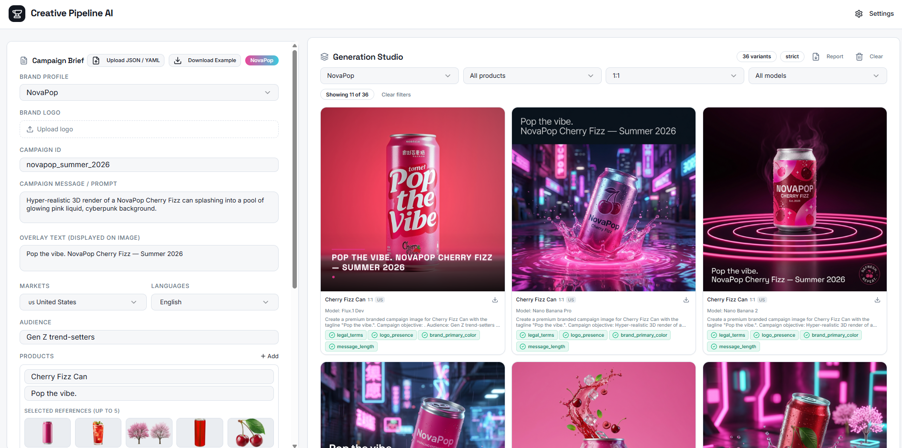
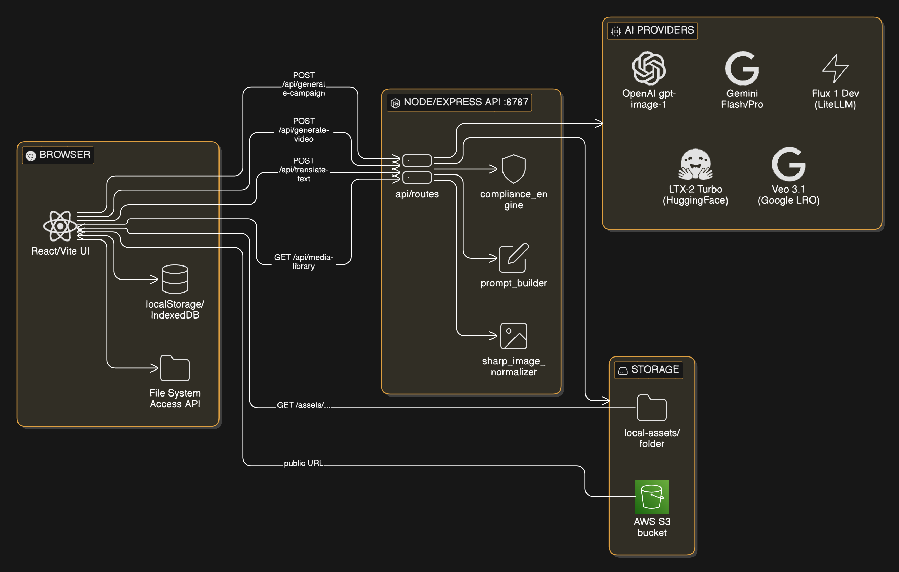
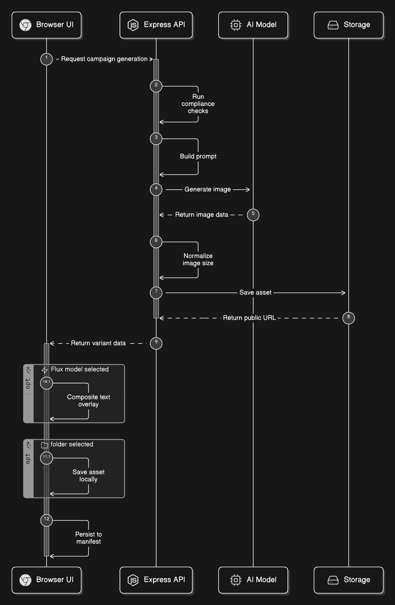
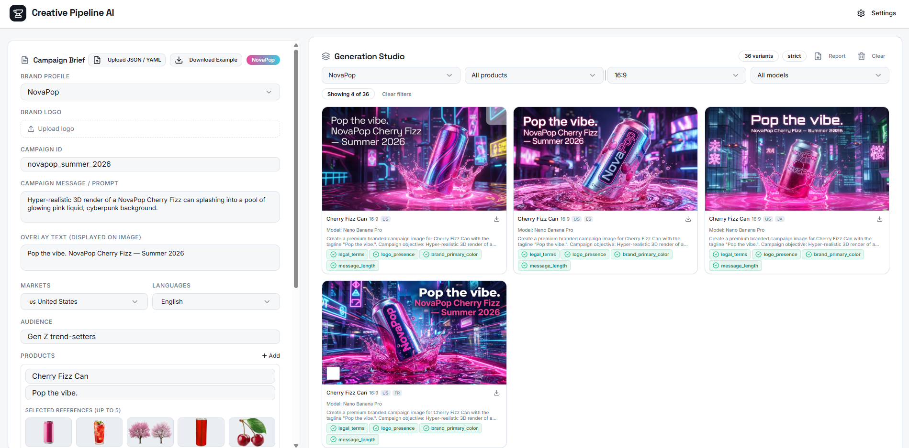
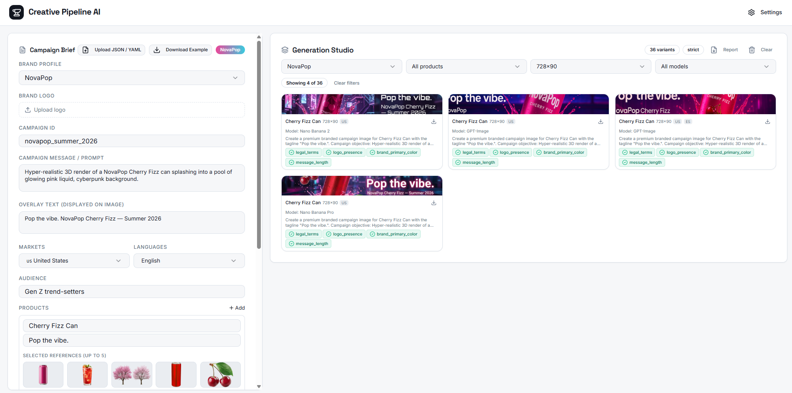
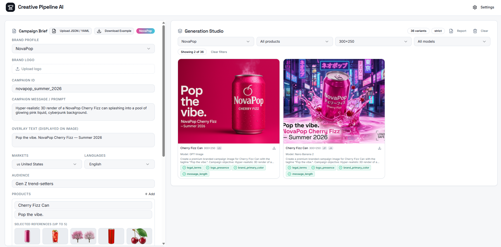
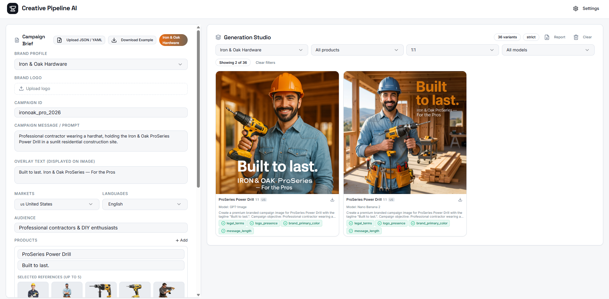
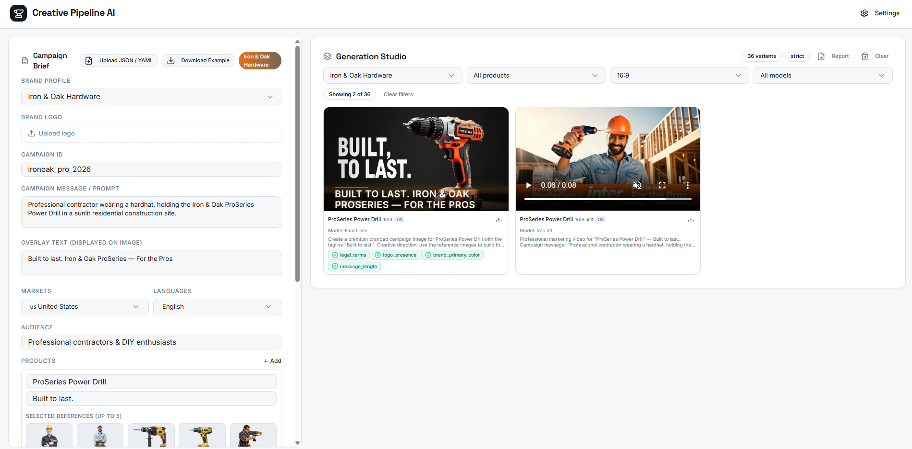
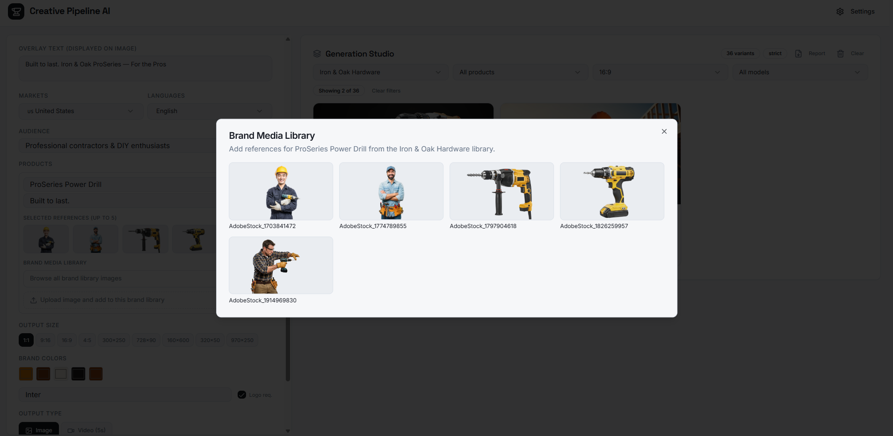
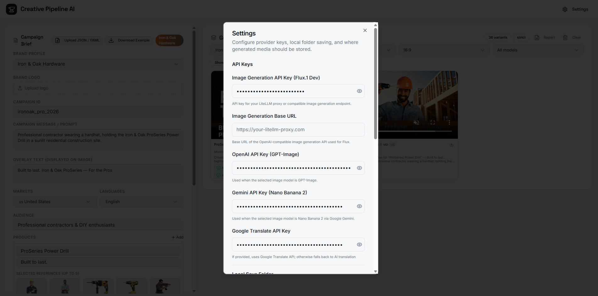

# Creative Pipeline AI

A local-first creative automation pipeline for generating localized, multi-format advertising assets at scale. Given a structured campaign brief, the pipeline produces campaign images (and videos) across multiple products, target markets, languages, and aspect ratios — using your choice of AI image/video model — and organizes all outputs by brand, campaign, product, and size.

## Table of Contents

- [Overview](#overview)
- [Architecture](#architecture)
- [Key Files](#key-files)
- [AI Services](#ai-services)
- [Storage](#storage)
- [Compliance and Legal Checks](#compliance-and-legal-checks)
- [Campaign Brief Format](#campaign-brief-format)
- [Supported Aspect Ratios](#supported-aspect-ratios)
- [How to Run](#how-to-run)
- [Example Output](#example-output)
- [Key Design Decisions](#key-design-decisions)
- [Assumptions and Limitations](#assumptions-and-limitations)

---

## Overview

Creative Pipeline AI accepts a campaign brief (JSON or YAML) that describes one or more products, target markets, audiences, and campaign messages. For each combination of product × market × language × aspect ratio it:

1. Runs pre-flight compliance checks (legal terms, profanity, brand rules).
2. Builds a model-aware prompt that encodes brand color, font mood, overlay text, reference-image guidance, and layout constraints for the requested canvas.
3. Calls the selected AI image or video model.
4. Composites overlay text onto the result (Flux) or relies on native in-prompt rendering (GPT-Image, Gemini).
5. Normalizes the output to the exact pixel dimensions of the requested format using `sharp`.
6. Saves the asset locally (Express static server or File System Access API) or to AWS S3.
7. Persists generation history in browser `localStorage` so the gallery survives page refreshes.

Two built-in brand profiles (NovaPop and Iron & Oak Hardware) are pre-loaded with sample media. Custom brands can be uploaded via JSON/YAML brief and are stored in `localStorage` for reuse.

---

## Architecture



**Architecture:** You fill out a campaign brief in the web app (left). The local server (middle) turns that brief into a set of ad variations, sends requests to AI services to create images/videos, then saves the results either on your computer or in your cloud storage so the gallery can display and download them.

**Request flow for a single image variant:**



**Single Image Generation:** For each size and product you request, the app does a quick safety check, writes clear instructions for the AI model, generates the creative, then resizes it to the exact ad dimensions and saves it. If you’ve chosen a local folder, it also exports a copy into your brand/campaign/product/size folders automatically.

## Product Screenshots















---

## Key Files

| File | Purpose |
|---|---|
| `server/index.ts` | All Express routes, AI provider adapters, compliance engine, prompt builder, storage helpers |
| `src/pages/Index.tsx` | Generation orchestration — iterates products × markets × languages × ratios, manages loading state, calls backend, persists manifest |
| `src/components/CampaignBriefForm.tsx` | Campaign brief UI, brand profiles, per-product media library, brief upload/download |
| `src/components/ResultsGallery.tsx` | Filterable gallery with brand / product / size / model filters and loading placeholders |
| `src/components/SettingsModal.tsx` | API key and storage configuration (stored in `localStorage`) |
| `src/lib/localSave.ts` | File System Access API — saves assets to a user-chosen folder organized by brand / campaign / product / size |
| `src/lib/textOverlay.ts` | Canvas-based text compositing for Flux images with dynamic font sizing |
| `shared/imageModels.ts` | Centralized model registry mapping display names → provider / request model / capability flags |
| `src/types/campaign.ts` | TypeScript interfaces for `CampaignBrief`, `Product`, `Brand`, `VariantResult`, `GenerationManifest` |

---

## AI Services

### Image Generation

Three providers are available and user-selectable from the generation form. All providers receive the same structured prompt; the backend adapts request format, authentication, and response parsing per provider.

#### Flux.1 Dev

- **Provider:** LiteLLM-compatible API (self-hosted or third-party endpoint)
- **Model key:** `flux.1-dev`
- **API pattern:** Submit job → receive `polling_url` → poll until `status: "Ready"` (up to 120 s)
- **Reference images:** Not natively supported. Reference count is injected as descriptive prompt guidance.
- **Text overlay:** Not rendered in the model. After generation, the frontend composites overlay text onto the image using the Canvas 2D API (`src/lib/textOverlay.ts`). Font size is computed dynamically so text always fits within the frame — including narrow formats like 160×600.
- **Output normalization:** `sharp` resizes the returned image to the exact target pixel dimensions.

#### GPT-Image (`gpt-image-1`)

- **Provider:** OpenAI
- **Model key:** `gpt-image`
- **API pattern:**
  - No references → `POST /v1/images/generations` with `quality: "high"`
  - With references → `POST /v1/images/edits` with `multipart/form-data`; multiple reference images use the `image[]` array parameter
- **Reference images:** Natively supported via the edits endpoint (up to 5 per product).
- **Text overlay:** Rendered natively inside the image via prompt instruction (`Render the exact overlay text "..." visibly inside the image`).
- **Size mapping:** Prompt dimensions map to the nearest supported OpenAI canvas (`1024x1024`, `1024x1536`, `1536x1024`).

#### Nano Banana 2 / Nano Banana Pro (Google Gemini)

- **Provider:** Google Gemini
- **Model keys:**
  - `nano-banana-2` → `gemini-3.1-flash-image-preview`
  - `nano-banana-pro` → `gemini-3-pro-image-preview`
- **API pattern:** `POST /v1beta/models/{model}:generateContent` with `responseModalities: ["TEXT", "IMAGE"]`
- **Reference images:** Natively supported via `inlineData` parts prepended to the content array.
- **Text overlay:** Rendered natively via prompt instruction.
- **Aspect ratio mapping:** The requested ratio is mapped to the closest ratio supported by Gemini's `imageConfig.aspectRatio` (e.g. `728x90` → `21:9`, `160x600` → `9:16`).

### Video Generation

Video models are shown in the model dropdown only when the output type is set to `video`.

#### LTX-2 Turbo

- **Provider:** HuggingFace Gradio space (`alexnasa-ltx-2-turbo.hf.space`)
- **Model key:** `ltx-2-turbo`
- **API pattern:** Gradio SSE event stream; optional first-frame image uploaded via `POST /upload` before the predict call.
- **Supported ratios:** 16:9, 9:16, 4:5, 1:1 (mapped to pixel dimensions).

#### Veo 3.1

- **Provider:** Google Gemini
- **Model key:** `veo-3.1-generate-preview`
- **API pattern:** `POST /v1beta/models/veo-3.1-generate-preview:predictLongRunning` → receive operation name → poll `GET /v1beta/{operation}` every 5 s until `done: true` → download video via the URI returned in `generateVideoResponse.generatedSamples[0].video.uri`.
- **Requires:** Google Cloud project on Tier 1 billing with the Gemini API enabled.
- **Aspect ratios:** Mapped to `16:9` or `9:16` only (Veo constraint).
- **Duration:** 8 seconds, 1 sample per request.

### Translation

When multiple languages are specified in the brief, the overlay text and campaign message are translated before generation. The backend uses a priority waterfall:

1. **Google Translate API** — if `google_translate_api_key` is configured
2. **OpenAI** — if `openai_api_key` is configured
3. **Gemini** — if `gemini_api_key` is configured

If none are configured, the original text is used.

---

## Storage

### Local App Storage (default)

Generated assets are written to `local-assets/` in the project root and served by Express at `/assets/...`.

```
local-assets/
  {campaign_id}/
    {product_id}/
      {ratio_safe}/           e.g. 1x1, 9x16, 728x90
        {timestamp}.png
```

### AWS S3

If AWS credentials are configured in the Settings modal, assets are uploaded via `PutObjectCommand` from `@aws-sdk/client-s3`. The returned public URL is stored in the gallery manifest. Required settings:

- AWS Access Key ID
- AWS Secret Access Key
- AWS Region
- S3 Bucket Name

Note: Buckets configured with "Bucket owner enforced" ACLs should not enable public-read ACLs — the bucket's own policy controls access.

### Browser Folder Export (File System Access API)

After generation, each asset can also be saved to a user-selected local folder via the browser's File System Access API (`src/lib/localSave.ts`). Files are organized as:

```
{chosen-folder}/
  {brand}/
    {campaign}/
      {product}/
        {size}/
          {filename}.png
```

### Brand Media Library

Pre-loaded reference images for built-in brands live in:

```
local-assets/media/
  NovaPop/          (7 images)
  IronOak/          (4 images)
```

User-uploaded references are stored in a brand-scoped `uploaded/` subdirectory and served through the same `/assets/` static route. The `GET /api/media-library?brand_key=` endpoint enumerates all images for a brand. New uploads are saved via `POST /api/media-library`.

---

## Compliance and Legal Checks

Compliance runs synchronously before any AI API call is made. A failing check in `strict` mode blocks generation entirely and returns HTTP 422. In `advisory` mode, the check is flagged in the response metadata but generation continues.

| Check | Logic | Strict behavior |
|---|---|---|
| `legal_terms` | Blocked terms list (`banned`, `unsafe`, `guaranteed cure`, `miracle`, `risk-free`) + `@coffeeandfun/google-profanity-words` (EN and ES engines) | Blocks |
| `message_length` | Campaign message must be ≤ 200 characters | Blocks |
| `logo_presence` | Acknowledged when `brand.logo_required: true` | Advisory |
| `brand_primary_color` | Registered for overlay when present | Advisory |

Compliance results are returned with every variant response and displayed on each gallery card.

---

## Campaign Brief Format

Briefs are accepted as JSON or YAML. Upload via the "Upload JSON / YAML" button in the UI, or click "Download Example" to get a working NovaPop sample.

### Full JSON Example

```json
{
  "brand_name": "NovaPop",
  "campaign_id": "novapop_summer_2026",
  "message": "Hyper-realistic 3D render of a NovaPop Cherry Fizz can splashing into a pool of glowing pink liquid, cyberpunk background.",
  "overlay_text": "Pop the vibe. NovaPop Cherry Fizz — Summer 2026",
  "markets": ["US", "UK"],
  "audience": "Gen Z trend-setters",
  "languages": ["en", "es"],
  "products": [
    {
      "id": "cherry_fizz",
      "name": "Cherry Fizz Can",
      "tagline": "Pop the vibe.",
      "reference_images": []
    },
    {
      "id": "blue_burst",
      "name": "Blue Burst Can",
      "tagline": "Feel the rush.",
      "reference_images": []
    }
  ],
  "requested_ratios": ["1:1", "9:16", "16:9", "4:5", "728x90", "160x600"],
  "image_model": "flux.1-dev",
  "output_type": "image",
  "brand": {
    "primary_color": "#e8368f",
    "font_family": "Space Grotesk",
    "logo_required": true,
    "logo_safe_zone_percent": 4
  },
  "compliance_mode": "strict"
}
```

### Equivalent YAML

```yaml
brand_name: NovaPop
campaign_id: novapop_summer_2026
message: >
  Hyper-realistic 3D render of a NovaPop Cherry Fizz can splashing into a pool
  of glowing pink liquid, cyberpunk background.
overlay_text: "Pop the vibe. NovaPop Cherry Fizz — Summer 2026"
markets:
  - US
  - UK
audience: Gen Z trend-setters
languages:
  - en
  - es
products:
  - id: cherry_fizz
    name: Cherry Fizz Can
    tagline: Pop the vibe.
  - id: blue_burst
    name: Blue Burst Can
    tagline: Feel the rush.
requested_ratios:
  - "1:1"
  - "9:16"
  - "16:9"
  - "4:5"
  - "728x90"
  - "160x600"
image_model: flux.1-dev
output_type: image
brand:
  primary_color: "#e8368f"
  font_family: Space Grotesk
  logo_required: true
  logo_safe_zone_percent: 4
compliance_mode: strict
```

### Field Reference

| Field | Type | Required | Description |
|---|---|---|---|
| `brand_name` | string | no | Display name for the brand (used in gallery and folder names) |
| `campaign_id` | string | yes | Unique identifier; becomes a folder segment in storage paths |
| `message` | string | yes | Creative direction / campaign prompt. Can be empty if `overlay_text` is provided |
| `overlay_text` | string | no | Text rendered on the final creative. Composited post-generation for Flux; embedded via prompt for GPT-Image and Gemini |
| `markets` | string[] | yes | Target market codes, e.g. `["US", "DE", "JP"]`. Each market produces a separate generation pass |
| `audience` | string | yes | Description of the target audience; included in the prompt |
| `languages` | string[] | no | BCP-47 language codes. Overlay text is translated per language before generation |
| `products` | Product[] | yes | At least one product. Each product × ratio produces one asset |
| `products[].id` | string | yes | Unique product identifier; used as a folder segment |
| `products[].name` | string | yes | Product name used in the prompt |
| `products[].tagline` | string | no | Short tagline injected into the prompt |
| `products[].reference_images` | string[] | no | Data URLs or public image URLs to use as reference (up to 5). Products with no references skip reference-image logic entirely |
| `requested_ratios` | string[] | yes | List of aspect ratios or exact pixel sizes. See [Supported Aspect Ratios](#supported-aspect-ratios) |
| `image_model` | string | no | Model key from the registry. Defaults to `flux.1-dev` |
| `output_type` | `"image"` \| `"video"` | no | Defaults to `"image"` |
| `brand.primary_color` | string | yes | Hex color used as prompt accent and text overlay stripe color |
| `brand.font_family` | string | no | Font mood hint injected into the prompt |
| `brand.logo_required` | boolean | no | Triggers a logo safe-zone reservation in the prompt |
| `brand.logo_safe_zone_percent` | number | no | Percentage of frame to reserve for logo (default 12) |
| `compliance_mode` | `"strict"` \| `"advisory"` | no | `strict` blocks generation on compliance failures; `advisory` flags but continues |

---

## Supported Aspect Ratios

All ratios and named sizes accepted by `requested_ratios`. Exact pixel sizes are passed directly; named ratios are resolved to pixels.

| Input | Width | Height | Common use |
|---|---|---|---|
| `1:1` | 1024 | 1024 | Instagram feed, Facebook post |
| `4:5` | 820 | 1024 | Instagram portrait |
| `9:16` | 576 | 1024 | Instagram / TikTok Stories, Reels |
| `16:9` | 1024 | 576 | YouTube thumbnail, Twitter card |
| `300x250` | 300 | 250 | Medium Rectangle display ad |
| `728x90` | 728 | 90 | Leaderboard display ad |
| `160x600` | 160 | 600 | Wide Skyscraper display ad |
| `320x50` | 320 | 50 | Mobile banner |
| `970x250` | 970 | 250 | Billboard display ad |
| Any `WxH` | W | H | Custom pixel dimensions |

Flux generation dimensions are clamped to multiples of 32 within 256–1440 px per side. OpenAI size is mapped to its nearest supported canvas. Gemini aspect ratio is mapped to the closest supported Gemini ratio.

---

## How to Run

### Prerequisites

- Node.js 20 or later
- At least one AI provider API key (see Settings)

### Install

```bash
npm install
```

### Environment (optional)

Create `.env` from `.env.example` to override the default API port:

```env
VITE_API_BASE_URL=http://localhost:8787
```

All provider credentials are configured through the in-app Settings modal and stored in browser `localStorage`. Nothing sensitive is written to disk by the server.

### Start

```bash
npm run dev
```

This starts both processes concurrently:

| Process | URL |
|---|---|
| React / Vite frontend | `http://localhost:8080` |
| Node / Express API | `http://localhost:8787` |

### Configure API Keys

Open the Settings modal (gear icon, top-right). Enter the keys for the providers you want to use:

| Setting | Used by |
|---|---|
| Flux API Key + Base URL | Flux.1 Dev image generation |
| OpenAI API Key | GPT-Image generation, OpenAI translation fallback |
| Gemini API Key | Nano Banana 2/Pro image generation, Veo 3.1 video, Gemini translation fallback |
| Google Translate API Key | Primary translation provider |
| AWS Access Key ID / Secret / Region / Bucket | Cloud storage (optional) |

### Generate Assets

1. Select a brand profile (NovaPop, Iron & Oak Hardware, or upload a custom JSON/YAML brief).
2. Adjust campaign details, products, markets, languages, and aspect ratios.
3. Optionally add reference images to individual products from the brand media library or by uploading new images.
4. Select an image or video model.
5. Click **Generate**.

A loading placeholder appears in the gallery for each pending variant. Completed assets are shown with their model, compliance status, and full prompt available on hover/expand.

### Other Scripts

```bash
npm run build          # Production build of the frontend
npm run preview        # Preview the production build locally
npm run start:server   # Start only the Express API
npm test               # Run unit tests
```

---

## Example Output

### Server-side storage (`local-assets/`)

```
local-assets/
  novapop_summer_2026/
    cherry_fizz/
      1x1/
        1712345678901.png
      9x16/
        1712345678902.png
      728x90/
        1712345678903.png
    blue_burst/
      1x1/
        1712345678910.png
  media/
    NovaPop/
      AdobeStock_509906177.png
      ...
      uploaded/
        1712345679000_product_shoot.png
    IronOak/
      AdobeStock_1797904618.png
      ...
```

### Browser folder export

When a local save folder is selected in Settings, the same generation produces:

```
{chosen folder}/
  NovaPop/
    novapop_summer_2026/
      Cherry_Fizz_Can/
        1x1/
          cherry_fizz_1712345678901.png
        9x16/
          cherry_fizz_1712345678902.png
        728x90/
          cherry_fizz_1712345678903.png
```

### Gallery card metadata

Each generated card in the UI displays:

- Rendered image or video preview at correct aspect ratio
- Product name, brand, market, language, and size
- Model used (e.g. "Flux.1 Dev", "GPT-Image", "Nano Banana 2", "Veo 3.1")
- Compliance check results (pass / flag / fail per rule)
- Full prompt used for generation (expandable)
- Download button

The gallery supports filtering by brand, product, size, and model, and shows a "Showing X of Y" badge when filters are active.

---

## Key Design Decisions

### Provider abstraction via a model registry

`shared/imageModels.ts` maps every model key to a `{ provider, requestModel, displayName, supportsNativeReferenceImages }` record. Adding a new model is a single registry entry; the backend `switch (modelInfo.provider)` and the frontend model selector both pick it up automatically.

### Per-product reference images

Reference images are attached to individual products (up to 5 each), not globally to the campaign. Products with no references skip reference logic entirely; products with references send them natively (GPT-Image, Gemini) or encode the count as prompt guidance (Flux). This means a two-product campaign can have one product use a lifestyle photo reference while the other generates purely from the prompt.

### Prompt construction adapts to brief content

`buildPrompt()` handles three modes transparently:

- **Full message + overlay text:** Campaign objective drives the scene; overlay text is reserved as negative space (Flux) or rendered natively (GPT-Image, Gemini).
- **Overlay text only (empty message):** The overlay text becomes the creative direction; the model is instructed to build the scene around it.
- **Neither:** A polished branded scene is generated from the product identity alone.

### Dynamic text layout for narrow formats

For Flux images, the Canvas 2D overlay renderer in `src/lib/textOverlay.ts` computes font size iteratively from the available canvas area rather than using a fixed size. A 160×600 skyscraper and a 970×250 billboard both receive fully readable, non-truncated text.

### Compliance before API calls

`runComplianceChecks()` runs synchronously against the brief message before any AI provider is contacted. In `strict` mode, a single failing check returns HTTP 422 immediately, preventing wasted quota. The same check results are surfaced in the gallery card so reviewers can see exactly what was evaluated.

### Gallery history persisted in the browser

The generation manifest (all variant metadata, URLs, prompts, compliance results) is stored in browser `localStorage`. Refreshing the page or reopening the app restores the full gallery. No server-side database is required.

### Local-first, credentials-never-on-server

API keys entered in the Settings modal are stored in browser `localStorage` and forwarded to the Express backend only as request body parameters on each generation call. The server writes no credentials to disk. Switching providers or rotating keys requires no server restart.

---

## Assumptions and Limitations

- **API keys** are stored in browser `localStorage`. This is appropriate for a local POC; a production deployment would use a secrets manager or OAuth.
- **Flux** requires a separately hosted LiteLLM-compatible endpoint (e.g. fal.ai, Together AI, Replicate, or a self-hosted instance). The base URL is configured in Settings.
- **Veo 3.1** requires a Google Cloud project on Tier 1 billing with the Gemini API enabled. Free-tier quota does not cover this model.
- **LTX-2 Turbo** relies on a public HuggingFace Gradio space being available. Cold-start latency can be 60–90 s if the space has been idle.
- **Video aspect ratios** for Veo 3.1 are limited to 16:9 and 9:16 (Google API constraint).
- **Gallery history** is browser-local only. Clearing browser storage removes generation history; assets on disk or S3 are unaffected.
- **Multi-language generation** translates the overlay text and message, but the AI model is not explicitly constrained to generate text in the target language — prompt language context is provided as a hint only.
- **Image normalization** uses `sharp` to resize outputs to exact target dimensions. For extreme aspect ratios (e.g. 728×90) the model's native output is resized, which may affect image quality depending on the model's native aspect ratio support.

---

## Scaling to Production

The POC architecture maps cleanly onto a production-grade system:

- **Queue-based job processing:** Replace the synchronous per-variant API call with a job queue (e.g. BullMQ + Redis) so thousands of variants can be dispatched and processed in parallel without blocking the HTTP response.
- **Persistent storage and database:** Move the manifest from `localStorage` to a database (e.g. PostgreSQL) and from local disk to object storage (S3, Azure Blob, GCS) with CDN distribution.
- **Secret management:** Replace browser `localStorage` key storage with a secrets manager (AWS Secrets Manager, Azure Key Vault) and a server-side credential resolver.
- **Multi-tenant brand management:** The current `BUILTIN_BRAND_PROFILES` + `localStorage` custom brand pattern maps to a brands table in the database with per-tenant media library buckets.
- **Model routing and fallback:** The provider registry in `shared/imageModels.ts` can be extended with cost, latency, and quality metadata to enable automatic routing, A/B model testing, and graceful fallback when a provider returns an error or rate-limit.
- **Audit trail and reporting:** Each `VariantResult` already captures model, prompt, compliance results, and timestamps — forwarding this to a data warehouse enables per-campaign quality and cost reporting.
- **CI/CD and containerization:** The `server/index.ts` Express API and the Vite frontend have no external dependencies beyond Node.js and npm, making them straightforward to containerize and deploy independently.
